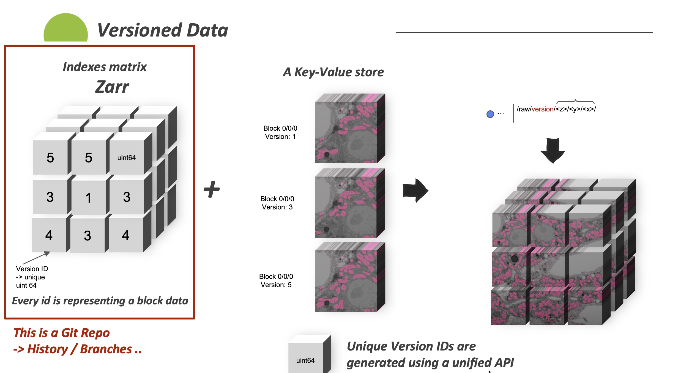

### Versioned Storage Java SDK

Java implementation of Block based versioned data storage. Python implementation is [here](https://github.com/JaneliaSciComp/VersionedStorage/).

----
#### Proposed solution:
To enable version management for nd data, a mix is created of:
- Version block index using [Zarr](https://zarr.readthedocs.io/en/stable/) + [Git](https://git-scm.com/) 
- A key value store: using [N5](https://github.com/saalfeldlab/n5) for now

#### Example: [open test class](src/main/java/org/janelia/scicomp/v5/tests/TestsWriter.java) 

----
#### for MAC M1 Chip:

1- install c-blosc: brew install c-blosc

2- Look for it: brew list c-blosc -v

3- jvm param: -Djna.library.path=/opt/homebrew/Cellar/c-blosc/1.21.1/lib/
